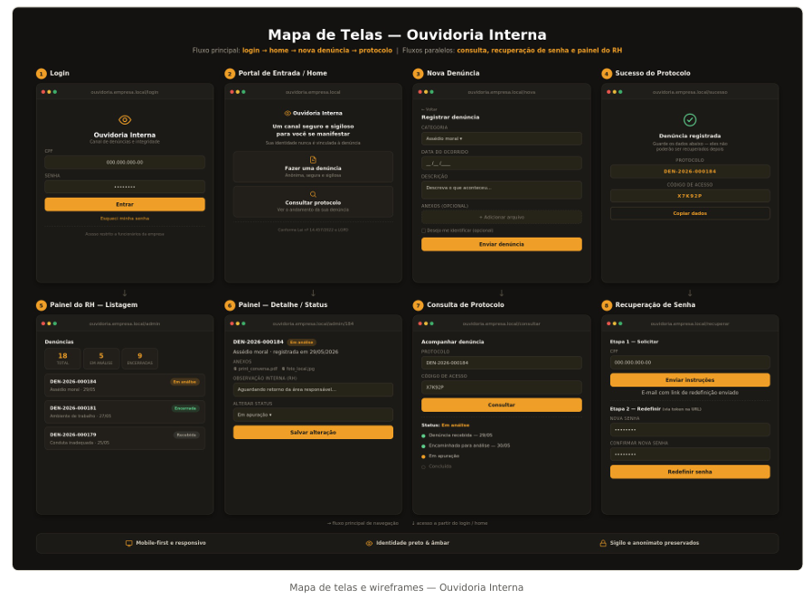

# Referência visual do frontend

Esta é a referência visual aprovada para o frontend da Ouvidoria Interna da MB.FREIRE, registrada em 05/09/2026.

## Arquivos

- `references/ouvidoria-screen-map.png`: mapa de telas e referência principal de layout.
- `references/mbfreire-logo-source.png`: imagem original recebida da marca, mantida apenas como fonte visual.
- `../../public/brand/mbfreire-logo.png`: versão PNG com fundo transparente destinada ao uso na aplicação.

## Direção obrigatória

- O frontend deve seguir a hierarquia, a composição e a linguagem visual do mapa de telas.
- A interface deve ter aparência corporativa, discreta e profissional.
- Usar superfícies em grafite, detalhes e ações primárias em âmbar/dourado, texto claro e contrastes moderados.
- Evitar aparência de alerta, excesso de cores fortes, efeitos chamativos e preto absoluto quando um grafite for suficiente.
- Usar cartões, campos e botões com acabamento sóbrio, espaçamento consistente e cantos discretamente arredondados.
- A implementação deve ser mobile-first e responsiva, mesmo que o mapa de telas apresente as telas agrupadas em formato desktop.
- O logo usado pela aplicação deve ser o PNG transparente em `public/brand/mbfreire-logo.png`, preservando proporção, cores, margens e legibilidade.

## Fluxos representados

O mapa visual cobre a base esperada para:

1. login;
2. portal de entrada/home;
3. criação de denúncia;
4. confirmação com protocolo e código de acompanhamento;
5. listagem administrativa de denúncias;
6. detalhe administrativo e alteração de status;
7. consulta de denúncia por protocolo;
8. recuperação e redefinição de senha.

O mapa define a direção de UX/UI, mas não substitui o contrato técnico. Campos, enums, permissões, rotas de API e comportamentos de integração devem seguir o `CONTEXT_BACKEND.md`.

## Referência principal

